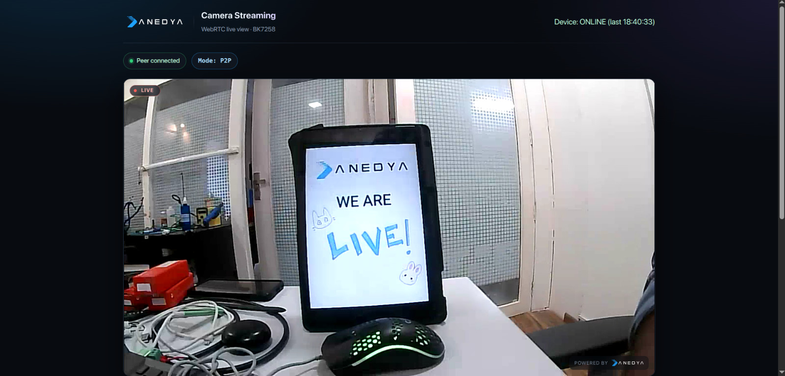

[](https://docs.anedya.io?utm_source=github&utm_medium=link&utm_campaign=github-examples&utm_content=beken-cam)
[](https://anedyaio.github.io/anedya-camera-livestream-example-beken/)

<p align="center">
    
</p>

# Beken BK7258 — WebRTC Camera Livestream with Anedya



Turn a Beken BK7258 with a UVC camera into a real-time, two-way audio and video
device with Anedya (Commands signalling and TURN relay).

## ✨ Features

- **Signalling :** SDP offer/answer exchanged via Anedya Commands over MQTT, no custom signalling server needed
- **Peer to peer with TURN relay fallback :** Direct WebRTC connection, falling back to Anedya's TURN relay when a firewall blocks it
- **Real H.264 video over RTP :** 720p hardware-encoded video on a proper WebRTC media track, not JPEG over a DataChannel. [View Here](https://anedyaio.github.io/anedya-camera-livestream-example-beken/)
- **Two-way audio :** Onboard microphone to the browser and browser microphone to the onboard speaker, G.711A, with echo cancellation
- **Packet-loss recovery :** NACK retransmission (RFC 4585), so a dropped packet costs a round trip instead of a whole frame
- **Reconnects on its own :** Wi-Fi and MQTT both retry with exponential backoff, so an unattended camera survives an AP reboot

---

## 📋 Supported Development Environments

| Framework / Platform | Status |
|---|---|
| Beken Armino AVDK (Docker) | Available |

Builds on Linux, macOS and Windows — the toolchain runs inside Beken's official
Docker image, so nothing is installed on your machine but Docker itself. See
[Prerequisites](#-prerequisites) for a step-by-step setup.

---

## 📷 Anedya — Board Support

| Board | Support Status | Notes |
|---|---|---|
| Beken BK7258 development board | Supported | 2.4 GHz Wi-Fi only |

| Camera | Support Status | Notes |
|---|---|---|
| USB UVC camera (720p, MJPEG) | Supported | Transcoded to H.264 on-chip |

---

## 📁 Repository Layout

```
  ├── app/                            — the firmware
  │   ├── ap/include/
  │   │   └── anedya_config.h         — ★ Wi-Fi + Anedya credentials + all tuning
  │   ├── ap/src/
  │   │   ├── anedya_cam_core.c       — boot, event loop, Wi-Fi reconnection
  │   │   ├── anedya_cam_mqtt.c       — Anedya MQTT, Commands signalling, reconnection
  │   │   ├── anedya_cam_webrtc.c     — libpeer lifecycle, offer/answer, media wiring
  │   │   ├── anedya_cam_devices.c    — UVC camera and voice service
  │   │   └── anedya_cam_network.c    — Wi-Fi station
  │   ├── ap/config/bk7258_ap/config  — SDK configuration, documented inline
  │   └── partitions/                 — flash and PSRAM layout
  │
  ├── web/
  │   ├── index.html                  — browser viewer, single self-contained file
  │   └── README.md                   — serving it, and what its diagnostics mean
  │
  ├── docs/
  │   ├── PORTING_REPORT.md           — architecture, and every bug that had to be solved
  │   └── PATCHES.md                  — the six SDK changes, with reasoning for each
  │
  ├── tools/                          — build wrappers (bash + PowerShell)
  ├── sdk/                            — Beken Armino AVDK          (submodule)
  └── libpeer/                        — WebRTC implementation      (submodule)
```

---

## 🧰 Prerequisites

You need **three things**: Git, Docker, and a serial terminal. Nothing else —
no compilers, no SDK installer, no Python packages.

### Docker

The firmware is built inside Beken's official Docker image, so the compiler and
every tool it needs are already set up and identical on every machine. You never
install a toolchain.

<details>
<summary><b>Windows</b></summary>

1. Install [Docker Desktop](https://docs.docker.com/desktop/install/windows-install/)
2. During setup, keep **"Use WSL 2 instead of Hyper-V"** ticked (the default)
3. Start Docker Desktop and wait for the whale icon in the tray to stop animating
4. Check it works — open PowerShell:

   ```powershell
   docker run --rm hello-world
   ```

</details>

<details>
<summary><b>macOS</b></summary>

1. Install [Docker Desktop](https://docs.docker.com/desktop/install/mac-install/)
   — pick the **Apple Silicon** or **Intel** build to match your Mac
2. Start it and wait for the whale icon in the menu bar to settle
3. Check it works:

   ```bash
   docker run --rm hello-world
   ```

On Apple Silicon the build image is x86-64 and runs under emulation. It works,
but expect the first build to be noticeably slower.

</details>

<details>
<summary><b>Linux</b></summary>

1. Install Docker Engine using
   [Docker's own instructions](https://docs.docker.com/engine/install/) for your
   distribution — the `docker.io` package in some distro repositories is old
2. Add yourself to the `docker` group so you do not need `sudo`:

   ```bash
   sudo usermod -aG docker $USER
   ```

3. **Log out and back in** for that to take effect
4. Check it works:

   ```bash
   docker run --rm hello-world
   ```

If you get "permission denied while trying to connect to the Docker daemon
socket", step 2 or 3 did not take. Do not work around it with `sudo` — see the
warning in the build step below.

</details>

#### The build image

```
bekencorp/armino-idk:1.2
```

It is on Docker Hub and **the build script pulls it automatically** the first
time you build, so there is nothing to do in advance. It is a large download
(roughly 2 GB) and happens once.

If you would rather fetch it up front, or the automatic pull fails behind a
proxy:

```bash
docker pull bekencorp/armino-idk:1.2
```

### USB-UART adapter

A **CH340**-based adapter is recommended, or Beken's own serial tool board.
Some adapters are unreliable at the rates the flashing tool uses.

### Serial terminal

To watch the device boot you need something that opens a serial port at
**115200 baud**:

| Platform | Options |
|---|---|
| Windows | [PuTTY](https://www.putty.org/), or the terminal built into Beken's flashing tool |
| macOS | `screen /dev/tty.usbserial-XXXX 115200`, or [CoolTerm](https://freeware.the-meiers.org/) |
| Linux | [`picocom -b 115200 /dev/ttyUSB0`](https://github.com/npat-efault/picocom), or `screen` |

### Git

Any recent version. You need submodule support, which has been standard for
years.

---

## 🚀 Getting Started

### 1. Clone with submodules

```bash
git clone --recursive https://github.com/anedyaio/anedya-camera-livestream-example-beken.git
cd anedya-camera-livestream-example-beken
```

Forgot `--recursive`? Run `git submodule update --init --recursive`.

### 2. Create your Node

A Node has **two different identifiers**. They are not interchangeable, and
mixing them up is the most common way to get stuck here:

| Identifier | Who creates it | Used by |
|---|---|---|
| **Physical Device ID** | **You**, before creating the Node | The firmware — `ANEDYA_DEVICE_UUID` |
| **Node ID** | **The console**, once the Node exists | The browser viewer page |

The **Physical Device ID** is yours to choose, not something the console
issues. Generate a UUID (v4) from any generator and create the Node using it —
supplying your own avoids colliding with an existing device. The format is
8-4-4-4-12 hex digits:

```
xxxxxxxx-xxxx-xxxx-xxxx-xxxxxxxxxxxx
```

The **Node ID** is issued by the console *after* the Node is created. You
cannot pick it and it is not your UUID. Keep it — the viewer page asks for it
in step 6.

> **Preauthorize the Node.** Without it the device is refused at connect time
> even though the UUID and key are correct, and it looks exactly like a wrong
> credential. Check this first if MQTT will not connect.

### 3. Fill in your credentials

**One file. Nothing else needs editing.**

```
app/ap/include/anedya_config.h
```

| Setting | Where it comes from |
|---|---|
| `ANEDYA_WIFI_SSID` / `_PASSWORD` | Your 2.4 GHz network |
| `ANEDYA_DEVICE_UUID` | The **Physical Device ID** — the UUID you generated in step 2, *not* the Node ID |
| `ANEDYA_CONNECTION_KEY` | Issued by the console alongside the Node |
| `ANEDYA_TURN_USERNAME` / `_CREDENTIAL` | Anedya console → **Relays** → create a relay credential |

The file explains each one inline, including how each fails when it is wrong.

> **TURN credentials expire.** The trailing number in the username is a Unix
> timestamp — the moment they stop working. An expired pair makes the relay
> answer `401`, which looks exactly like a code bug and is not one. Generate a
> fresh pair from the Relays section when that happens.

#### Two pairs of things that are easy to confuse

The firmware and the browser page authenticate **separately**, with different
credentials. Nothing you put in `anedya_config.h` is used by the browser:

| The firmware uses | The browser page uses |
|---|---|
| **Physical Device ID** — the UUID you generated | **Node ID** — issued by the console |
| **Connection Key** — the device's, issued with the Node | **Platform API Key** — your account's |

You need all four, in two different places. Putting a Node ID in
`ANEDYA_DEVICE_UUID`, or a Platform API Key in `ANEDYA_CONNECTION_KEY`, fails
in a way that looks like a broken build rather than a wrong value.

### 4. Build

```bash
./tools/build.sh          # Linux / macOS
.\tools\build.ps1         # Windows (PowerShell)
```

Output: `sdk/build/bk7258/app/package/all-app.bin`

> Do **not** build with `sudo`. The container runs as your own user; under
> `sudo` every generated file becomes root-owned and the next normal build
> fails with a permission error.

### 5. Flash

Firmware is burned over UART with **BKFIL**, Beken's official tool.

Download it from **<https://dl.bekencorp.com/tools/bkfil/v4/gui>** — pick the
latest version for your operating system.

> ### 🛑 First time with a new board: disable the CRC check
>
> **A brand-new module will not start up properly until the CRC feature is
> disabled.** This is done once, ever, and can be burned together with the
> firmware — so do it now rather than wondering later why the board is silent.
>
> 1. Download `efuse_config_disable_crc.json` from
>    <https://dl.bekencorp.com/tools/disable_crc>
> 2. In BKFIL's **Download** page, click the **otp/efuse** option and select
>    that file
> 3. Select your port and click **Download**, alongside the firmware below
> 4. Check the log to confirm it succeeded
>
> **Do not modify that file.** It is a fixed configuration from Beken, and
> editing it will stop the device booting. You never need to repeat this step
> for later firmware updates.

**Burning the firmware:**

1. Open BKFIL and go to the **Download** page
2. Select the firmware:

   ```
   sdk/build/bk7258/app/package/all-app.bin
   ```

3. Choose the serial port — it is the one labelled **DL_UART0**
4. Click **Download**
5. **Power cycle the device** once burning completes

> **Stuck on `Getting Bus...`?** Press the board's reset button once to restore
> the CPU state, and it will continue.

**Serial adapter.** A **CH340**-based USB-UART adapter is recommended, or
Beken's own serial tool board. Not every adapter negotiates reliably at the
rates BKFIL uses; if burning fails repeatedly, try a lower baud rate or a
different adapter before suspecting the firmware.

> **Open-source alternative.** The community
> [BK7231GUIFlashTool](https://github.com/openshwprojects/BK7231GUIFlashTool)
> also flashes these parts. This example was developed on Linux using
> [`ltchiptool`](https://github.com/libretiny-eu/ltchiptool). Neither is
> supported by Beken, and neither performs the CRC-disable step above — use
> BKFIL for that at least once.

### 6. Watch it boot

Connect to **DL_UART0** at **115200 baud**. The same port carries the CLI, so
`help` lists the SDK's built-in commands.

```
Wi-Fi connected
IP: 192.168.1.42
MQTT connected to Anedya!
WebRTC subsystem ready, waiting for offer...
```

### 7. Open the viewer

**Just open `web/index.html` in your browser.** Double-click it, or drag it into
a window. No web server, no build step — it is a single self-contained file.

> ### ⚠️ Use Chrome or Edge
>
> Other browsers have known WebRTC issues with this stream that are outside our
> control. Firefox and Safari negotiate H.264 differently and are not supported
> here.

Enter your **Node ID** and **Platform API Key** in Settings, then press
**Start Handshake**. Settings are remembered in the browser, so you only do this
once.

See [`web/README.md`](web/README.md) for what the page's diagnostics mean.

---

## 🏗 How It Works

### Signalling via Anedya Commands + MQTT

WebRTC requires both peers to exchange SDP offers and answers before media can
flow. This example uses Anedya Commands as the signalling channel and Anedya
MQTT as the notification mechanism.

```
Browser Viewer
  │  1. Fetch TURN credentials (Anedya REST API)
  │  2. Create WebRTC offer → Commands (base64(deflate(SDP)))
  ▼
Anedya Cloud  (Commands + MQTT broker + TURN relay)
  │  3. Notify BK7258 over MQTT subscription
  ▼
BK7258
  │  4. Decode offer, parse SDP, learn the peer's payload types and mids
  │  5. Gather ICE candidates, create answer → Commands
  ▼
Browser Viewer
  │  6. Poll Commands status → read answer → apply remote description
  │  7. ICE negotiation completes, DTLS handshake derives the SRTP keys
  │  8. H.264 video and G.711A audio flow over SRTP, both directions
```

An SDP is far larger than the ~1 KB Commands payload budget, so offers and
answers are raw-deflate compressed and base64 encoded in both directions —
`miniz` on the device, `CompressionStream("deflate-raw")` in the browser.

### Media over RTP, not DataChannel

Unlike simpler examples that push JPEG frames over a DataChannel, this one uses
**real WebRTC media tracks**. Video is H.264 from the chip's hardware encoder,
packetised into RTP with FU-A fragmentation; audio is G.711A in both directions.
The browser decodes it with its native pipeline, and standard WebRTC machinery —
NACK, PLI, jitter buffering — works as intended.

The trade is complexity: codec negotiation, SRTP keying and packetisation all
have to be right. [`docs/PORTING_REPORT.md`](docs/PORTING_REPORT.md) records
what that took.

### Connectivity

When both peers can reach each other, ICE resolves a direct path using STUN
address discovery. When a firewall blocks direct traffic, Anedya's managed TURN
relay is used automatically — this example implements the **device side of the
relay**: Allocate, CreatePermission, ChannelBind, and the periodic Allocate
Refresh that keeps a long session from being torn down mid-stream.

---

## 🩺 Troubleshooting

**Board does nothing at all after a first flash** — the CRC check was probably
never disabled. See the warning in step 5; a new module will not start up until
`efuse_config_disable_crc.json` has been burned once.

**Burning stalls at `Getting Bus...`** — press the board's reset button once.

**Nothing on serial** — wrong port (use DL_UART0) or baud (115200). On Linux,
add yourself to the `dialout` group and log back in.

**Wi-Fi never connects** — 5 GHz network, or a typo. The board is 2.4 GHz only.

**MQTT never connects** — check the Node is **preauthorized** first, then that
`ANEDYA_DEVICE_UUID` holds the **Physical Device ID** and not the Node ID, then
the Connection Key. All four failures look identical from outside: the broker
closes the connection right after CONNECT.

**Connects, but no video** — usually SDP negotiation or SRTP. Look for
`srtp_out is NULL — sending UNENCRYPTED RTP` in the log.

**Works on the same Wi-Fi, fails across networks** — TURN credentials. Check
the expiry timestamp first.

**Video freezes on busy scenes** — look for `uvc_stre: Frame buffer overflow`
*before* blaming the network. That is the camera's MJPEG frame exceeding its
buffer, so the frame never reaches the encoder at all.

---

## 🔧 A note on the SDK

This example needs **six changed files, 93 lines** in the Beken SDK, and they
split into two kinds:

**Four are things the SDK already ships that we simply enabled.** We did not
modify any of that code. `rsa.c`, `ecdh.c`, `ecdsa.c`, `ecp.c`, `timing_alt.c`,
lwIP's MQTT client and its altcp TLS layer are all present in the SDK, byte for
byte as Beken wrote them — they were just missing from the components' explicit
source lists, so their symbols did not exist at link time. `MBEDTLS_TIMING_ALT`
and `MBEDTLS_SSL_DTLS_SRTP` were likewise already in Beken's config header,
commented out. The changes are two build lists, two uncommented `#define`s, and
one MQTT buffer size raised from a default too small to hold a real payload.

**Two are bug fixes to code that does not compile as delivered.** `ecp.c`
defines a `static` function whose name collides with a public, differently
signatured one that Beken declares in its own patched `bignum.h` — renamed, and
being `static` it is invisible outside that file. `altcp_tls_mbedtls.c` is
written against mbedTLS 2.x while the SDK ships 3.x, so TLS over lwIP is
unbuildable out of the box — ported to the 3.x API. **Beken has already fixed
the second one in `release/v4.0.1`.**

No driver, RTOS, Wi-Fi, USB or media-pipeline source is touched.

The SDK is consumed as a submodule of a fork, so you can see exactly what
differs from upstream:

```bash
git -C sdk log  release/v3.0.1..HEAD
git -C sdk diff release/v3.0.1..HEAD
```

Each change is a separate commit with its reasoning, and
[`docs/PATCHES.md`](docs/PATCHES.md) covers all six in detail.

---

## 📚 References

**Anedya**
- [Anedya Overview](https://docs.anedya.io/anedya-overview/)
- [Anedya Concepts](https://docs.anedya.io/essentials/concepts/)
- [Anedya Project Setup](https://docs.anedya.io/getting-started/project-setup/)
- [Anedya MQTT Endpoints](https://docs.anedya.io/device/mqtt-endpoints/)
- [Anedya Commands](https://docs.anedya.io/features/commands/commands-intro/)
- [Anedya Platform API](https://docs.anedya.io/platform-api/)

**WebRTC & Beken**
- [WebRTC Overview](https://webrtc.org/getting-started/overview)
- [WebRTC Peer Connections](https://webrtc.org/getting-started/peer-connections)
- [libpeer](https://github.com/sepfy/libpeer) — the WebRTC implementation this port builds on
- [Beken Armino AVDK](https://github.com/bekencorp/bk_avdk_smp)
- [Armino documentation — burning firmware](https://docs.bekencorp.com/arminodoc/bk_avdk_smp/smp_doc/bk7259/en/v4.0.1/get-started/index.html)
- [BKFIL flashing tool](https://dl.bekencorp.com/tools/bkfil/v4/gui)
- [RFC 5766 — TURN](https://datatracker.ietf.org/doc/html/rfc5766)
- [RFC 4585 — RTP/AVPF, Generic NACK](https://datatracker.ietf.org/doc/html/rfc4585)

---

## 📑 Looking for other examples

- [Anedya Camera Livestream with ESP32](https://github.com/anedyaio/anedya-camera-livestream-example-esp32)
- [Anedya Camera Livestream with Raspberry Pi](https://github.com/anedyaio/anedya-camera-livestream-example)

---

## 📄 License

Apache-2.0. Builds on the Beken Armino AVDK (Apache-2.0) and
[libpeer](https://github.com/sepfy/libpeer) (MIT), which uses libsrtp
(BSD-3-Clause), cJSON (MIT) and miniz (MIT). Each component keeps its own
licence file.
